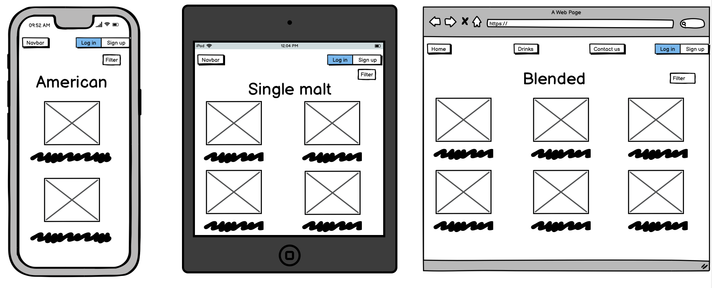
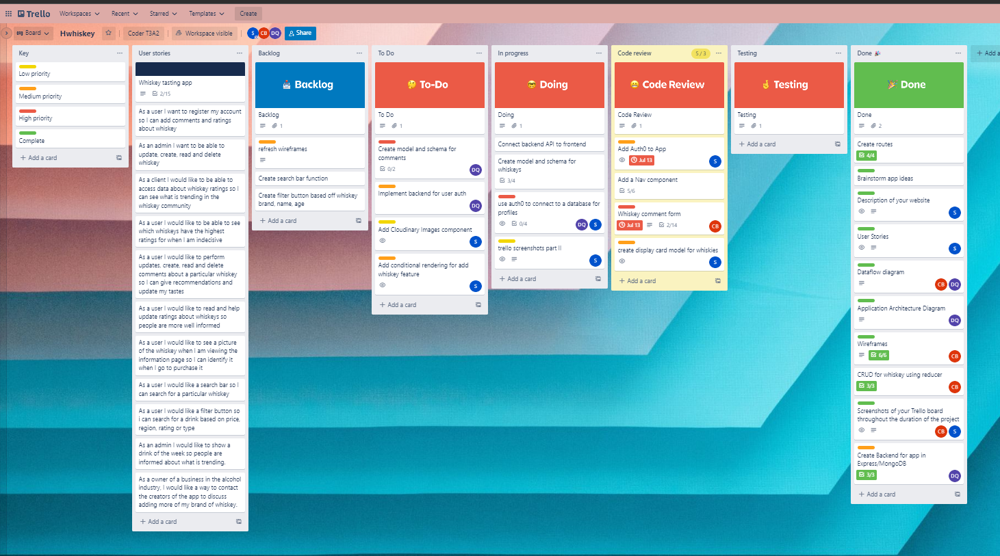

readme.md
# T3A2-A ( For T3A2-B, please click [here](#t3a2-b) )

[Link to our app](https://frontend-sigma-neon.vercel.app/whiskeys)

## Whiskey Testing App

### R1 Description of your website, including: 

#### Purpose

The intended primary purpose for this application is to provide a public platform for the testing of and subsequent rating of different types/brands of Whiskey. As whiskey is a very popular choice of liquor that is enjoyed worldwide, this app helps inform the general population of the different types of whiskey available. It also informs them of the region and age of the whiskey, with users being able to comment on the whiskey and add a 5 star rating to different categories that whiskey sommeliers tend to look out for. 

The Application is directed at companies such as Dan Murphy's as a platform for customer engagement, market research, and data use in a 'customer's choice' type advertisement booster. As it contains market data about the specific types of whiskeys, it is also very beneficial to bars, pubs or breweries that make whiskey as the ratings for each individual whiskey are available so businesses that promote or serve alcohol know which ones are more in demand. 

As we are also including a filter button within the app, this app can be used as a platform to fit the uses of a boutique whiskey manufacturer for the purposes of customer feedback for tours or general access online. Users will also know which whiskeys they will be looking out for when going on tour as the app may include a few different types from that particular brand, such as differences between Johnnie Walker black, double black or blue. 

The App is a great way to promote sales of whiskey while also promoting responsible drinking as the focus of the App is directed towards taste and appreciation.

#### Functionality and Features

The application is designed to have users engage by finding a whiskey they have a pre-existing interest in or read positive ratings about on the site; purchase the whiskey; taste test the whiskey; and leave a detailed review rating different fields of flavour/drinkability. Whiskies will have an added price range system of budget, average and top shelf.

Users will be able to search their whiskey through the search bar or a drinks page. The drinks page will have the different categories of whiskey, or they may filter their search to fit their needs.

Users will be able to create an account or log in to the app.

Users will have their own authenticatable profile data model for relation to tastings/ratings within the App.

Whiskies will have related images appear with their name in the search function. Once selected, a whiskey will have an overview and links to related reviews.

Roles will be used to let admin users add/remove whiskies as dictated by the client due to customer feedback/change of product.

The home page will feature a section for the promotion of specific whiskies with a 'Whiskey of the week' component.

Each whiskey will have multiple categories to rate out of 5, such as smell and taste which add to an overall rating.

Along with the ratings, a user will be able to provide a comment about that particular whiskey.

Users will be able to see the most popular whiskey on the Home page.

#### Target Audience

The target audience for this product is anyone of legal age with an appreciation for Whiskey. Although around 70% of whiskey drinkers are males in the 30 and older range (Distillery Trail, 2015), market trends are showing an increase in younger age ranges and especially an increase in the amount of women consuming the spirit (Dunn, 2019). This makes for a diverse audience range in age, gender and ethnicity.

#### Tech Stack

This Application is a MERN stack (MongoDB, ExpressJS, React and NodeJS). Git, github, cloudinary and heroku will also be used for this app.

##### MongoDB

MongoDb is a noSQL database program that is document-orientated. The whiskies, user data and comments will be stored in documents that will be linked together through specific foreign keys which will be added to their schema.

##### ExpressJS and NodeJS

Express is a back-end web development framework that will be used in conjunction with NodeJS for the creation of the routes in the form of middleware. User, whiskey and comment validation will be handled using Express and Node before allowing the data to be sent to the database, which is Mongo.

##### React

React is a front-end JavaScript library, which will be used to build UI components that deliver high quality user experience.

##### Cloudinary

Cloudinary is a cloud that will be used to store images of the whiskeys.

##### Heroku

This app uses Heroku as a platform for deployment.

##### Git and Github

The repo will be stored on github so each member of our team has a central repository that they can clone and branch and work on their own local machine. Git will be used as the source control to ensure smooth tracking and changes to the code.

### Dataflow Diagram

### Application Architecture Diagram

### User Stories

- "As a user I want to register my account so I can add comments and ratings about whiskey."

- "As an admin I want to be able to update, create, read and delete whiskies."

- "As a client I would like to be able to access data about whiskey ratings so I can see what is trending in the whiskey community."

- "As a user I would like to be able to see which whiskies have the highest ratings for when I am indecisive on what to purchase."

- "As a user I would like to perform updates, create, read and delete comments about a particular whiskey so I can give recommendations and update my tastes."

- "As a user I would like to read and help update ratings about whiskeys so people are more well informed."

- "As a user I would like to see a picture of the whiskey when I am viewing the information page so I can identify it when I go to purchase it."

- "As a user I would like a search bar so I can search for a particular whiskey."

- "As a user I would like a filter button so I can search for a drink based on price, region, rating or type."

- "As an admin I would like to show a drink of the week so people are informed about what is trending."

- As a owner of a business in the alcohol industry, I would like a way to contact the creators of the app to discuss adding more of my brand of whiskey.

### R5 Wireframes

### First wireframes

#### Sign up page

#### Home page

#### Drinks catalogue page

#### Show specific drink

#### Add comment

#### User profile

### Contact us

### Revised wireframes

#### Sign up page

#### Home page

#### Drinks catalogue page

#### Adding a drink

#### Show specific drink

#### Add comment

#### User profile

### Contact us

### - Trello Board screenshots

[Link to Trello Board](https://trello.com/b/gLpp5IGX/hwhiskey)  

Screenshots of App progress shown through the Kanban board so far:

Initial Shot part 1
 

Initial Shot part 2

Shot 2

Shot 3

Shot 4

Shot 5

Shot 6

Shot 7

Shot 8

Shot 9

Shot 10 - Complete for part A

Shot 11

Shot 12

Shot 13

Shot 14

Shot 15

Shot 16

Shot 17

Shot 18

Shot 19

Shot 20

Shot 21

Shot 22

Shot 23

------------------------------------------------------------------------------------------------------------------------------------------------

# T3A2-B

### R2 - Write well designed code that uses appropriate libraries

- Axios - Used to connect HTTP requests to the backend. Axios is a promise based HTTP client for JavaScript, which can be used in place of fetch. It does a lot of the work for us, such as setting headers and parsing to JSON as some examples.

- Immer - Immer was used to allow us to get easy access to nested states. If we were to not use immer, we would have to spread out the state twice in order to access the value we wish to change, however with Immer, it allowed us to create a shallow copy of the state called a draft, and then we can access the values we need. It does not mutate the original state, rather creates a copy of it.

- @mui/material/Rating - This library was used to create a 5 star rating system. This was used as our rating system for the tastings component, so users could use their mouse and hover over the amount of stars they wish to give to the whiskey tasting.

- React-router-dom - This library was used in our app as we wished to create a single page application. If we were to use `<link>` tags in our code, once clicked the website would reload and defeat the purpose of a single page application, which is the speed it has as it never has to reload. Rather, the screen just re-renders and with the use of the `<Link>` tags within react-router-dom, we can show the illusion of navigating to another page, whereas in reality it is the same page. It also allowed us to modularise our code as all the Navigation routes will be placed together. It also had the `useParams` hook within the package, which let us use the param id of the items being retrieved from the database to show the singular items that were retrieved from the database and manipulate the data.

- @heroicons/react/outline - This library allowed us to use their icons within our app. Rather than having to source our own icons and add it in manually, we could browse their library and import only what we needed, which allowed our code to be a lot more DRY and require less files.

- @headlessui/react - This library allowed us to access UI components that were designed to work in conjunction with Tailwind CSS. By using both headlessui/react and tailwind, we could make our SPA reactive to different screen sizes and allowed easy customisation of components in order to be more aesthetically pleasing.

- moment - Moment is a library which allowed us to parse, validate, manipulate and format dates.

- react-paginate - This library allowed us to paginate our whiskeys page. We could set it to how many were the maximum it could display, and the displays were from a dataset, which is our array from whiskeys. We decided to only show 6 whiskeys per page, so it breaks our array into units of 6 and displays 6 whilst the rest are put on other pages.

- tailwind CSS - Tailwind css is a CSS framework that allows easy applying of CSS to our page, as well as make it reactive with much less work needed rather than not using a CSS framework.

- @testing-library/jest-dom - This library allows us to create a virtual DOM that is used for testing purposes.

- vitest - Vitest is the testing framework that we used as we used vite instead of CRA in terms of creating the react app. It is based off jest which is compatible with CRA, however as we used Vite, vitest was more suitable for us.

- @testing-library/react - This library  allows us to create tests for react. It adds APIs for working with react components and uses DOM nodes, which are found in the other library mentioned earlier `@testing-library/jest-dom`. It gives helper methods which help us specify our tests, such as finding form elements, finding text content and such.

- Express.js - Express is a backend framework that was developed for Node.js. It allows us to create web applications and APIs, which is what we used it for. Express was used to create and connect the backend routes to the frontend, allowing us to create a full-stack web app.

- mongoose - Mongoose is an Object Data Modeling (ODM) library for MongoDb and Node.js. It allows us to connect the backend routes to MongoDb, which was our database and have access to the documents that were stored in our database, or create new entries within our database.

- supertest - Supertest was our testing library for our backend. It allowed us to test HTTP requests and to ensure that they were working as intended. HTTP requests include such as GET, PATCH, DELETE and POST.

### R3 - Employ and utilise proper source control methodology (git)
- The link to our organisation is [here](https://github.com/T3A2-Wolfpack). The two repositories we used for this project are called **backend** and **frontend**.

- The commit history for the **backend** can be found [here](https://github.com/T3A2-Wolfpack/frontend/commits/master) and the commit history for the **backend** repo can be found [here](https://github.com/T3A2-Wolfpack/backend/commits/main).

### R4 - Demonstrate your ability to work in a team

#### Use a recognised project management methodology
Our team followed the Agile project management methodology. We had a meeting at 11am every day where we discuss what we had done the previous day and any bugs or problems we faced. We also discussed how we can fix those bugs or problems and then discussed what the plan was for that day. During the standup, we would delegate tasks on our Kanban board and move cards around from backlog to "to-do" and such. 

We had a sprint cycle end and start every Wednesday and Sunday, where we had scrum meetings to discuss what we had accomplished. During the scrum meetings, we would discuss the bugs and problems that the team members were stuck on for more than a day and try to delegate that section to another team member that could possibly fix it. If the other team member was unable to fix it, they would mention it during the next scrum meeting and we would then discuss and propose alternative features or workarounds.

Our team also used Vercel, which allowed for continuous deployment every time we pushed and merged into our main branch, which allowed us to test if our changes would break anything from development to production. As we merged into our branch multiple times a day, we could pin point exactly when something would break as deployment would fail. 

We also did unit testing as we created the routes in order to make sure that the routes were configured correctly. The unit testing allowed us to send HTTP requests to the database to ensure that the routes were in fact active and not broken.

#### Use a recognised task delegation methodology
We used a Kanban board to delegate tasks to our members daily. The link to our [trello board is here](https://trello.com/b/gLpp5IGX/hwhiskey)

### R8 - Provides evidence of user testing:

#### Development environment
[Development log](docs/Development.xlsx)

#### Production environment
[Production log](docs/Production.xlsx)

### R9 Utilises a formal testing framework
We have performed testing on both backend and frontend repos. To see the testing, please enter the repo and type `npm run test`.

##### References

Dunn, D 2019, *The New Face of the Average Whiskey Drinker: Young, Pierced, and Female*, Robb Report, viewed 1 July 2022, <https://robbreport.com/food-drink/spirits/who-are-the-new-whiskey-drinkers-2840639/>

Distillery Trail 2015, *Profile of the Average American Bourbon Drinker*, Distillery Trail, viewed 1 July 2022, <https://www.distillerytrail.com/blog/profile-of-the-average-american-bourbon-drinker-infographic/>